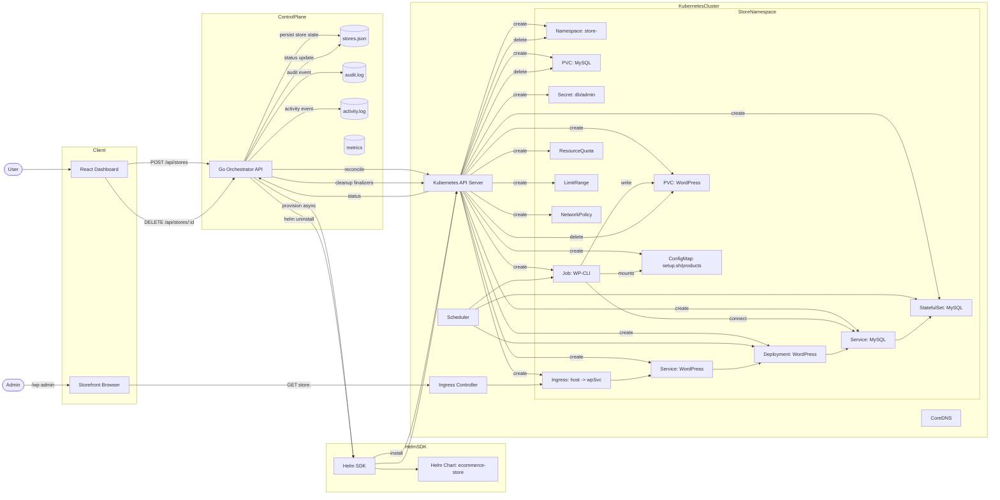
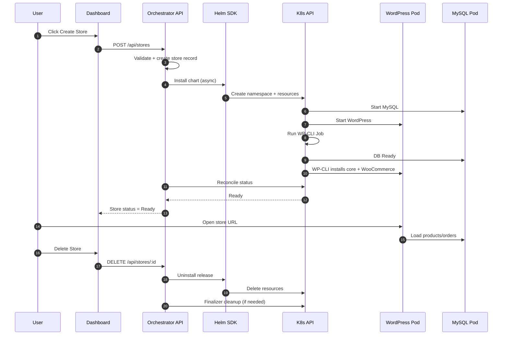

# Urumi Store Provisioning Platform — Nuts & Bolts Guide (Internal)

This document is intentionally detailed so you can defend every design choice and explain the full system end‑to‑end.
It is **not** meant for GitHub submission.

---

## 1) What you built (one‑paragraph overview)
A Kubernetes‑native store provisioning platform. A React dashboard calls a Go orchestrator API that provisions a WooCommerce store by installing a Helm chart into a dedicated namespace. The chart deploys WordPress + MySQL + a WP‑CLI Job that configures WooCommerce, activates themes/plugins, and seeds products. Each store is isolated by namespace, has its own Secrets, PVCs, Services, and Ingress. The same chart is used locally and on VPS; only values change (domains, ingress class, storage class, network policy).

---

## 2) End‑to‑end flow (create → ready → order → delete)

### Create
1) User clicks **Create Store** in the dashboard.
2) Dashboard `POST /api/stores` → orchestrator.
3) Orchestrator validates request, generates a unique store ID, creates a store record, and starts provisioning asynchronously.
4) Orchestrator uses Helm SDK to install the chart into `store-<id>` namespace with overrides (ingress host, secrets, storage class).
5) Kubernetes creates resources (StatefulSet, Deployment, Services, PVCs, Secrets, Ingress, Jobs, quotas).
6) WP‑CLI job waits for DB, installs WordPress, activates WooCommerce, seeds products, sets options.
7) Orchestrator reconcile loop detects readiness and marks store **Ready**.

### Use (checkout)
1) User opens store URL (Ingress host).
2) WordPress serves storefront. Products are visible (seeded).
3) User adds to cart and uses COD checkout.
4) Order is visible in WP admin panel.

### Delete
1) User clicks **Delete** in dashboard.
2) Orchestrator uninstalls Helm release and deletes namespace.
3) PVCs/PVs are deleted (for local‑path), finalizers cleared if needed.

---

## 3) Kubernetes resources used (what and why)

Each store creates a namespace `store-<id>` and uses these resources:

- **Namespace**: isolation boundary for all store resources.
- **Secret**: holds MySQL root/user password and WP admin password; avoids hardcoding.
- **StatefulSet (MySQL)**: guarantees stable identity + persistent storage. MySQL needs stable volume.
- **Deployment (WordPress)**: stateless web front end; can scale horizontally if needed.
- **PVCs**:
  - MySQL data PVC (RWO): persistent database state.
  - WordPress PVC (RWO): uploads/themes/plugins after install.
- **Service**:
  - MySQL service (cluster internal).
  - WordPress service (cluster internal).
- **Ingress**: routes `http://<store-id>.<base-domain>` → WordPress service.
- **Job (WP‑CLI)**: runs one‑time install/config and product import.
- **ConfigMap**: stores `setup.sh` and product import scripts.
- **ResourceQuota + LimitRange**: per‑namespace resource guardrails.
- **NetworkPolicy (prod values)**:
  - Ingress allowlist (ingress‑nginx or traefik namespace).
  - WordPress ↔ MySQL communication.
  - Optional egress to internet when needed.

Why this set:
- It is fully Kubernetes‑native and Helm‑friendly.
- It separates long‑lived state (DB/PVC) from stateless services (WordPress Deployment).
- It satisfies Round‑1 requirements explicitly.

---

## 4) Persistence model

- **MySQL PVC** stores the database. Without this, orders and users would be lost on pod restart.
- **WordPress PVC** stores wp‑content (uploads, themes, plugins). It allows WP‑CLI job to install plugins/themes and keep them.
- Storage class is controlled by `STORAGE_CLASS` and values overrides.

Local:
- `local-path` is typically default and suitable for demos.

VPS:
- `local-path` works for single‑node k3s.
- For production, a CSI like Longhorn is preferred.

---

## 5) Ingress + DNS (how URLs work)

Local:
- Use `nip.io` so `store-id.127.0.0.1.nip.io` resolves to localhost.
- Ingress controller routes host → WordPress service.

VPS:
- Use `nip.io` (`store-id.<public-ip>.nip.io`) or real wildcard DNS.
- Ingress controller must be exposed (LoadBalancer or NodePort) and ports 80/443 open.

---

## 6) Orchestrator internals (Go)

Key files:
- `orchestrator/main.go`: API server, request validation, async provisioning, status updates, background reconcile loop.
- `orchestrator/provisioner.go`: Helm SDK install logic, values merging, storage class detection, namespace access.
- `orchestrator/reconcile.go`: reads live Kubernetes state and sets store status (Provisioning/Ready/Failed).
- `orchestrator/cleanup.go`: uninstall release, delete namespace, finalizer cleanup.
- `orchestrator/store_manager.go`: store state, persistence to `stores.json`.
- `orchestrator/store_order.go`: list ordering and stable display.
- `orchestrator/utils.go`: helpers, random strings, merges, etc.

Why async provisioning:
- Helm install can take minutes; API should respond immediately.
- Store status is reconciled periodically to avoid stuck states.

Failure handling:
- Provisioning timeout, retries (configurable).
- Failed installs are marked failed with error message.
- Orphaned namespaces are cleaned.

---

## 7) Dashboard internals (React)

Key files:
- `dashboard/src/App.jsx`: main layout, state, API calls.
- `components/StoresPanel.jsx`: store list, status, URLs.
- `components/ActivityPanel.jsx`: shows events (created/failed/ready/deleted).
- `components/CreateStorePanel.jsx`: create store form.

API calls:
- `GET /api/stores` → list
- `POST /api/stores` → create
- `DELETE /api/stores/:id` → delete
- `GET /api/activity` → activity log
- `GET /api/metrics` → summary

---

## 8) Helm chart internals

Location: `charts/ecommerce-store`

Templates:
- `deployment.yaml`: WordPress Deployment
- `mysql-statefulset.yaml`: MySQL StatefulSet
- `service.yaml` + `mysql-service.yaml`
- `wordpress-pvc.yaml`: WordPress PVC
- `secret.yaml`: generated secrets
- `wpcli-configmap.yaml` + `wpcli-job.yaml`: WP‑CLI install flow
- `ingress.yaml`: host routing
- `limitrange.yaml` + `resourcequota.yaml`: guardrails
- `networkpolicy.yaml`: isolation

Values:
- `values-local.yaml`: local defaults
- `values-prod.yaml`: VPS defaults (network policy on, larger quotas)

Overrides per store:
- Ingress host
- Admin credentials
- Secrets
- Storage class

---

## 9) Scripts (entry points)

- `start.sh`: one‑command local runner (k3d + dashboard + orchestrator + port‑forwards).
- `start-vps.sh`: one‑command VPS wrapper (sets env + runs `start.sh` in VPS mode).
- `scripts/cluster.sh`: local cluster start/ready checks.
- `scripts/images.sh`: image build/import (k3d/k3s).
- `scripts/cleanup.sh`: clean failed namespaces, finalizers.
- `scripts/rbac.sh`: optional RBAC kubeconfig creation.

---

## 10) Design choices & tradeoffs

### Helm (vs Kustomize)
- Requirement says Helm is mandatory.
- Helm is better for parameterized per‑store values.

### k3d (local) vs k3s (VPS)
- **k3d**: lightweight Kubernetes in Docker; ideal for local dev.
- **k3s**: lightweight Kubernetes distribution for VPS; fewer dependencies.
- Both are CNCF‑conformant enough for this demo and support Helm.

### NGINX vs Traefik
- **NGINX** chosen for consistency across local and VPS and wider documentation.
- **Traefik** is default in k3s but behavior can vary; we keep it optional.

### WordPress + WooCommerce (engine)
- Lowest friction for a working ecommerce store.
- WP‑CLI allows deterministic setup + product import.

### Medusa stub
- Allowed by scope note. Architecture already supports engine switching.

---

## 11) Reliability & recovery

- Async provisioning prevents request timeouts.
- Reconcile loop updates status from live cluster state.
- Deletion cleans Helm release and namespace.
- Zombie namespace finalizers are removed when stuck.

---

## 12) Security posture (current)

- Secrets generated at runtime; stored in Kubernetes Secrets.
- Namespace isolation per store.
- NetworkPolicy enabled in prod values.
- RBAC optional; on VPS default uses admin kubeconfig for reliability.

Not implemented (explicitly):
- Non‑root containers across the board (WordPress images may assume root).

---

## 13) Scaling (current vs future)

Current:
- Orchestrator concurrency guard controls provisioning throughput.
- WordPress Deployment can scale horizontally if desired.

Future:
- HPA for API + dashboard (stateless).
- More robust queueing for provisioning bursts.

---

## 14) Troubleshooting checklist

- API offline: check `curl /healthz`, port 8080, NSG.
- Store opens install page: check WP‑CLI job log + DB connectivity.
- Ingress 404: ensure ingress‑nginx service exposed and ports 80/443 open.
- Provisioning timeout: check quota, PVC, pod scheduling.

---

## 15) Mermaid architecture (long form)

